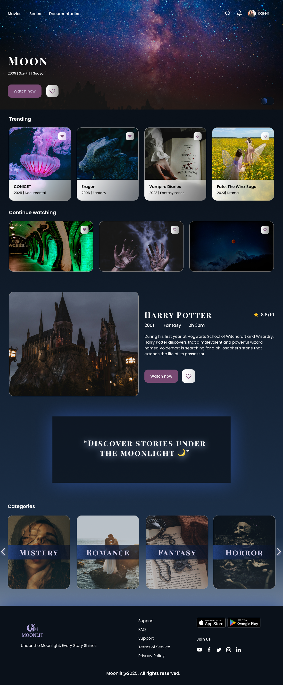

# 🌙 Moonlit – Proyecto Final (Curso Full Stack)

Este repositorio contiene la **parte Frontend** del proyecto final del curso de **Desarrollo Full Stack**.
Está desarrollado en **Angular** y se conecta con el **Backend en .NET**, donde trabajamos con APIs, ORM y persistencia de datos.

---

## 🎯 Objetivo

- Desarrollar la interfaz de usuario y la lógica de presentación.
- Aplicar componentes, directivas, servicios y ruteo en Angular.
- Integrar el Frontend con el Backend para construir una aplicación completa cliente-servidor.

---

## 🖼️ Preview

### Home de Moonlit



### Prototipo en Figma

[👉 Ver diseño en Figma](https://www.figma.com/design/MQQkGo0Bymqruo9M0EfIfU/Moonlit-Movies-Web?node-id=6-282&t=kLvVPvgOeTYw9akp-1)

---

## 📂 Estructura del trabajo

- **Ejercicios iniciales** → creación de componentes, variables, directivas (`*ngIf`, `*ngFor`), estilos y comunicación padre-hijo.
- **Servicios** → inyección de dependencias para compartir datos entre componentes.
- **Ruteo y navegación** → estructuración de vistas con `router-outlet`.
- **Integración con APIs** → consumo de datos externos mediante `HttpClient`.
- **Accesibilidad y mejoras** → incorporación de ARIA y prácticas recomendadas.

Cada ejercicio se implementa como un componente o módulo dentro de la aplicación.

---

## 🚀 Ejecución del proyecto

Instalar dependencias:

```bash
npm install
```

Levantar el servidor de desarrollo:

```bash
ng serve
```
